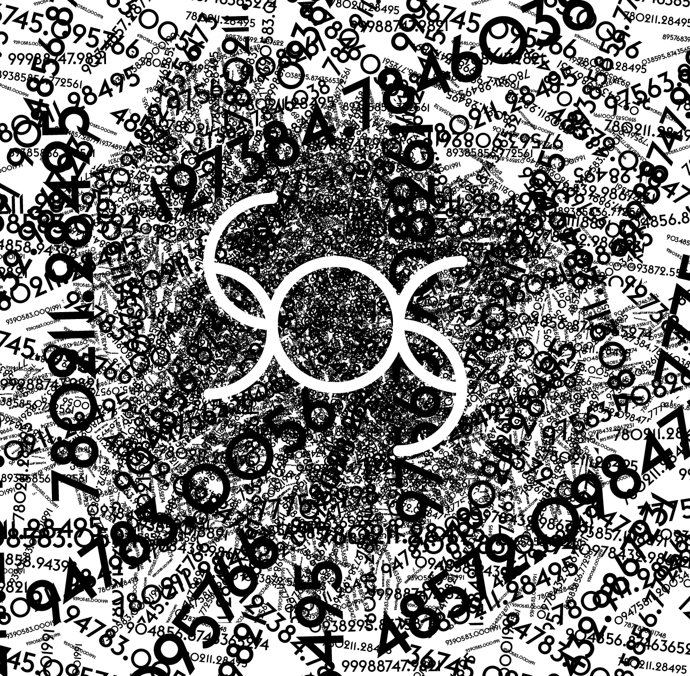

# SOS
The Stochastic Optimisation Software (SOS) is a research-oriented software platform for Metaheuristic Optimisation (Stochastic Optimisation). If you are using SOS, please acknowledge the article "Caraffini, F.; Iacca, G. The SOS Platform: Designing, Tuning and Statistically Benchmarking Optimisation Algorithms. Mathematics 2020, 8, 785."  (https://doi.org/10.3390/math8050785)

